# Leveraging Wick To Build Robust Data Pipelines

Top of mind for any Data Engineer at Netflix is to build fast, efficient, and robust data pipelines to capture facts and
derive metrics. This data helps the business understand content and system performance, power recommendations, and
drives other high-impacting decisions. In Ads, for example, our data drives billing. So data quality issues at the scale
of Netflix can be costly!

Meanwhile, AI has transformed the software development landscape. Many tasks are now automated using AI agents that can
write these data pipelines faster than ever. But how do we ensure AI-generated code actually produces correct results?  
When we think about a bug in software engineering, we often think about outages or functionalities that are not working
properly. In Data Engineering, bugs are sneakier. They can live for years unnoticed, producing wrong data that
negatively affect business decisions and revenues.

## Preventing data quality issues

There are a few different actions we can take to prevent bugs that leads to data quality issues:

**Code reviews** are a good way to bring fresh eyes (human and AI) to understand the proposed changes. However, it’s
hard for a reviewer to predict exactly how some code will behave in practice, making it easy for bugs to slip through.

**Testing** can prove that our pipelines produce data as expected and prevent future regressions. However, full coverage
is nearly impossible as it would require an absurd amount of tests for every possible scenario.

**Types** and typed languages have been less popular, especially in Data Engineering due to the rise of dynamic
languages like Python, which prioritize faster prototyping and development cycles by reducing boilerplate code since
type annotations add verbosity.  
However, there are a few benefits of using types that have become more relevant since the code is now generated by AI
agents:

* **Error Prevention and Safety**: Types catch "meaningless" operations (like dividing a number by a string) before they
  cause a crash. In statically typed languages like Scala, these errors are caught at compile-time, preventing them from
  ever reaching users.
* **Self-Documentation**: Explicit types serve as a living reference. A developer or an AI agent can understand what a
  function requires and returns (e.g., a Timestamp vs. a plain Long) without reading the internal logic.
* **Performance Optimization**: When a compiler knows the exact nature of data, it can allocate memory more efficiently
  and use specialized machine instructions for faster execution.
* **Better Tooling and Productivity**: Modern IDEs and AI agents use type information (through LSP) to provide accurate
  suggestions, instant error reporting, and safer refactoring.
* **Modeling Business Rules**: Custom types allow you to encode business logic directly into the language. For example,
  instead of using a generic string, you can create an EmailAddress type that ensures data is always validated before
  it's used. Or a Token type that ensures it’s never leaked
  with [Capture Checking](https://docs.scala-lang.org/scala3/reference/experimental/capture-checking/basics.html).

In essence, we want to use tools designed to provide business context to AI agents and prevent them from making mistakes
while enabling them to produce more accurate pipelines faster, using fewer tokens.

<div align="center">
  <b>“Make illegal states unrepresentable”</b><br>
  - Yaron Minsky in a guest lecture at Harvard
</div>

# Spark 101

When it comes to batch processing, Apache Spark is the tool of choice for Data Engineers at Netflix. It's a fast,
large-scale data processing framework that started with the Resilient Distributed Dataset (RDD) API. But its true value
lies in the Spark SQL layer that provides a DataFrame and SQL API. Those APIs are more declarative and enable a wide
range of optimizations.

<div align="center">

  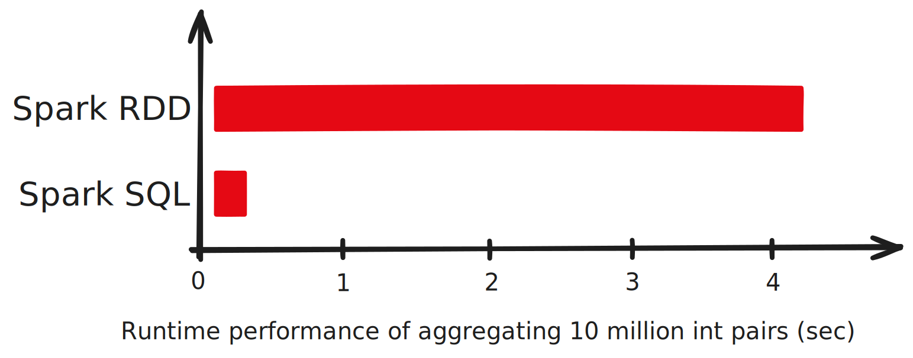
  Source: A Deep Dive into Spark SQL's Catalyst Optimizer with Yin Huai

</div>

As shown in the above graph, Spark SQL is very fast, which fits our need for efficient pipeline execution.  
But how is Spark achieving such levels of performance?

## The Catalyst Optimizer

The reason Spark SQL is fast is because the code written with the DataFrame API builds a “Logical Plan” that gets piped
into an optimizer called the Catalyst Optimizer to produce a “Physical Plan” that gets executed to process the data as
efficiently as possible.

In the below example, we have a job that reads two tables, joins them, filters, and projects some fields. The Logical
Plan (on the left) will be transformed to a more efficient Physical Plan (on the right) by the Catalyst Optimizer before
execution, saving significant compute power by loading only the needed data.

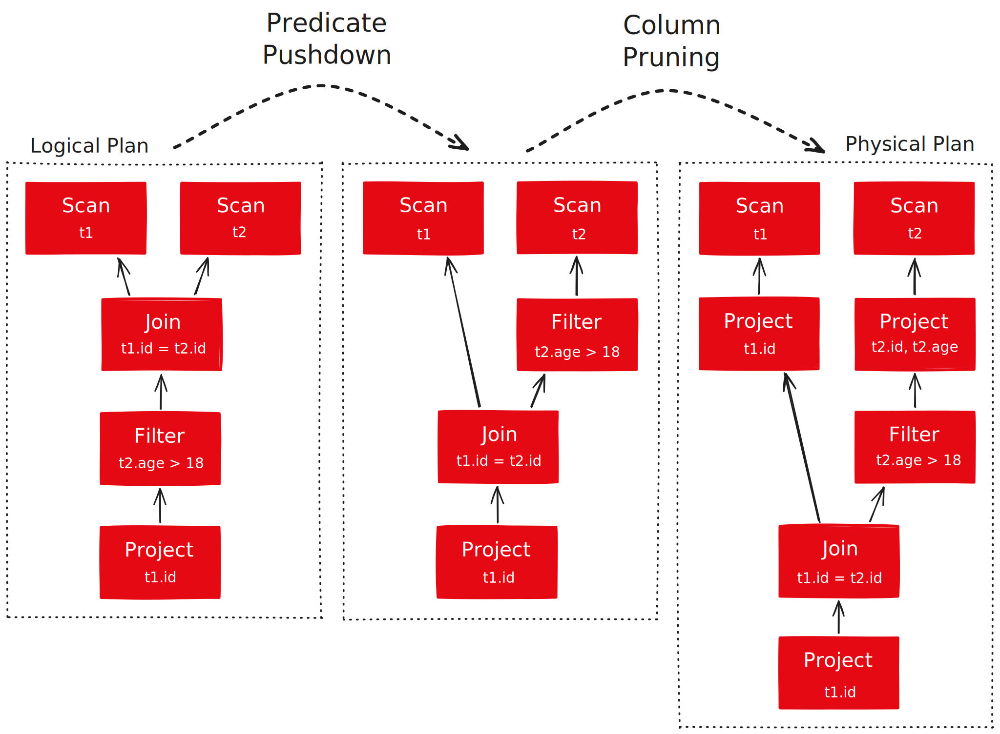

# The problem with Spark SQL

Spark SQL is fast, but it suffers from a poor API design that makes illegal state representable. This makes it easy to
introduce bugs that lead to data quality issues.

Let’s say we want to implement a naive version of a job that calculates the total spend in Ads per advertiser:

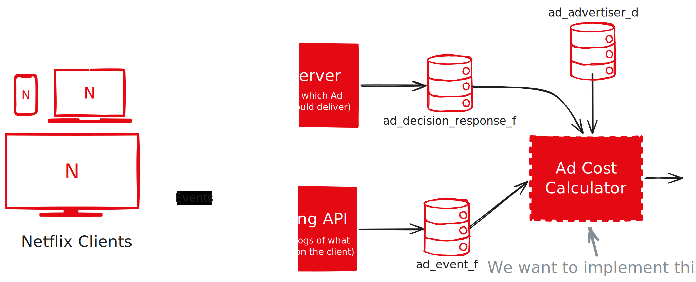

In this architecture:

* Clients ask the Ad Server “what ad should I display?”. These decisions get written to `ad_decision_response_f`.
* Once clients display an ad, they log an event to our Logging API which records it in `ad_event_f`.
* We also have the `ad_advertiser_d` table that contains information about our advertisers such as their names.

Let’s implement this job with the DataFrame API:  
```scala
@main def job(date: Int, hour: Int) =  
  // LOAD THE DATA  
  val adEvents = spark  
    .table("ad_event_f")  
    .filter(col("date") <=> date && col("hour") <=> hour)  
    .filter(col("event_type") <=> "AD_START")  
  val decisionResponses = spark  
    .table("ad_decision_response_f")  
    .filter(col("date") <=> date && col("hour") <=> hour)  
  val advertisers = spark.table("ad_advertiser_d")

  // JOIN DATA  
  val allJoined = adEvents  
    .join(  
      decisionResponses,  
      adEvents("ad_response_id") <=> decisionResponses("ad_response_id"),  
      "left"  
    )  
    .join(  
      advertisers,  
      decisionResponses("advertiser_id") <=> advertisers("advertiser_id"),  
      "left"  
    )

  // PROJECT DATA  
  val projected = allJoined.select(  
    advertisers("name").as("advertiser_name"),  
    decisionResponses("micros_usd").as("micros_usd")  
  )

  // AGGREGATE DATA  
  val totals = projected  
    .groupBy(col("advertiser_name").as("advertiser_name"))  
    .agg((sum("micros_usd") / 1_000_000).as("total_cash"))  
    .orderBy(desc("total_usd"))

  totals.show()
```

The DataFrame API has no knowledge of the tables it loads. `spark.table("ad_event_f")` returns a plain DataFrame, a
schema-less blob that carries none of the business context encoded in the table definition. Developers must look up
schemas in external tools, breaking their flow and leaving that context out of the code entirely.

1. **Untracked field names**. Columns are referenced by raw strings — `col("micros_usd")`, `col("advertiser_name")` —
   with no compile-time check that those fields exist. Notice anything wrong in this snippet?
   ```scala
   .agg((sum("micros_usd") / 1_000_000).as("total_cash"))  
   .orderBy(desc("total_usd"))  // ← "total_usd" doesn't exist
   ```
   The aggregation is named `total_cash`, but orderBy references `total_usd`. The DataFrame API considers this valid.
   The job compiles, runs, and produces wrong results.

2. **No type information**. Fields have no declared types. Is `ad_decision_response_f.advertiser_id` a String? A Long?
   The equality join between `decisionResponses("advertiser_id")` and `advertisers("advertiser_id")` might never match
   if the types differ, and the API won't tell you.

3. **Unchecked aggregations**. `agg()` accepts any column expression, including non-aggregate ones. Passing a linear
   expression (e.g., a plain column reference) instead of a scalar aggregate like `sum()` or `min()` compiles fine but
   fails at runtime.

4. **Silent null propagation**. Nullability is invisible in the API. There is no way to tell which fields are nullable,
   and the code provides no mechanism to handle them explicitly. Null values flow silently through joins and
   aggregations, producing subtly wrong output with no warning.

5. **Standard DataFrames offer no type-level distinction between join kinds**. A left join silently introduces nulls
   across every right-side column when no match is found, an anti join silently narrows the schema to the left side
   only. These semantics are invisible in the code and implementers must track them by convention.

In short, the DataFrame API makes every class of mistake representable: wrong field names, type mismatches, missing
aggregations, unhandled nulls. For a human reviewer these bugs are hard to spot. For an AI agent generating code, there
are no guardrails at all.

### Dataset API

Spark does offer a typed alternative: `Dataset[T]`. Unlike `DataFrame`, a `Dataset` is bound to a case class, so field
access is checked at compile time. It solves the naming and type problems described above.

But it comes at a cost. When you use typed Dataset operations — lambdas like `.map(row => row.field)` — Spark has to
serialize and deserialize JVM objects through encoders to cross the boundary between typed Scala code and the Catalyst
execution layer. This means Catalyst can no longer see inside those operations, limiting the optimizations it can apply.
The more you lean on Dataset's type safety, the more performance you leave on the table.

In practice, teams face an uncomfortable choice: use `DataFrame` and get full performance with no type safety, or use
`Dataset[T]` and trade away some of the performance gains that made Spark worth using in the first place.

Wick was built without this compromise.

# Wick’s API

Wick is an alternative Spark API developed at Netflix that provides a more robust, type-safe API than DataFrame while
keeping 100% of Spark’s Catalyst Optimizer performance.

Lets implement the same job using Wick’s API:
```scala
// DEFINE DATA TYPES
case class AdEvent(date: Int, hour: Int, ad_response_id: String, event_type: String)
case class AdDecisionResponse(date: Int, hour: Int, ad_response_id: String, advertiser_id: String, micros_usd: Long)
case class AdAdvertizer(advertiser_id: Long, name: String | Null)

@main def job(date: Int, hour: Int) =
// LOAD THE DATA
val adEvents = spark
  .loadTable[AdEvent]("ad_event_f")  
  .filter(event => event.date === date && event.hour === hour)  
  .filter(event => event.event_type === "AD_START")  
val decisionResponses = spark
  .loadTable[AdDecisionResponse]("ad_decision_response_f")  
  .filter(event => event.date === date && event.hour === hour)  
val advertisers = spark.loadTable[AdAdvertizer]("ad_advertiser_d")

// JOIN DATA  
val allJoined = adEvents  
  .leftJoin(
    decisionResponses,  
    (adEvent, decisionResponse) => adEvent.ad_response_id === decisionResponse.ad_response_id  
  )
  .leftJoin(  
    advertisers,  
    (adEvent, decisionResponse, advertiser) =>  
      nullable(decisionResponse.?.advertiser_id) === advertiser.advertiser_id.asString
  )

  // PROJECT DATA
  val projected = allJoined.select((adEvent, decisionResponse, advertiser) =>  
    (
      advertiser_name = nullable(advertiser.?.name.orElse(decisionResponse.?.advertiser_id)).orElse("Unknown"),
      micros_usd = nullable(decisionResponse.?.micros_usd)
    )  
  )

  // AGGREGATE DATA  
  val totals = projected  
    .groupBy(row => (advertiser_name = row.advertiser_name))  
    .agg(row => (total_usd = nullable(sum(row.micros_usd).? / 1_000_000)))  
    .orderBy(total => desc(total.total_usd))

  totals.show()
```

The difference is immediate, the job's schema is declared upfront as plain Scala case classes. Every field has a name, a
type, and a nullability constraint. That context lives in the code itself, available to compilers, IDEs, and AI agents
without any external lookup.

1. **Field names are compile-time checked**. Misnaming a field, like referencing `total_usd` when the aggregation is
   called `total_cash`, is a compiler error, not a silent runtime failure. The bug that went unnoticed in the DataFrame
   version cannot exist in Wick:   
   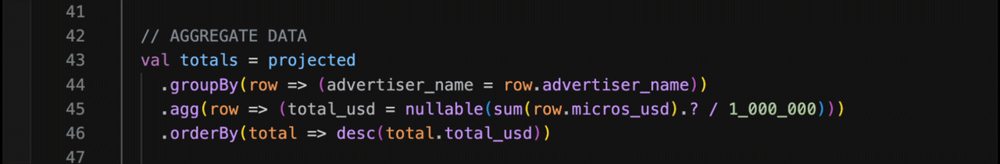

   IDEs and AI agents can leverage
   the [Language Server Protocol](https://microsoft.github.io/language-server-protocol/) (LSP) to provide accurate
   suggestions:  
   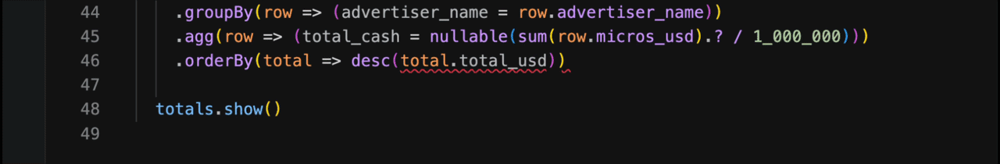

2. **Fields are typed**. Hence, preventing illegal operations impossible:  
   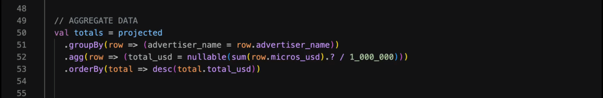

3. **Nullability is explicit and tracked**. Fields declared as T | Null propagate their nullability throughout the
   pipeline. So null values can never flow silently through functions and produce unexpected results:  
   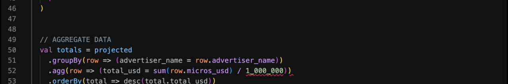

   Wick also provides a clean API to handle nulls: nullable() and .? are useful to access a nullable field bubbling up
   nulls to the nullable() call:  
   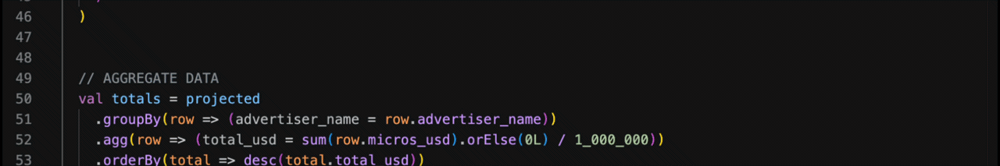

4. **Types flow through every expression**. Wick knows the declared type of every field. Comparing
   `decisionResponse.advertiser_id` (a String) with `advertiser.advertiser_id` (a Long) is a type error caught at
   compile time:  
   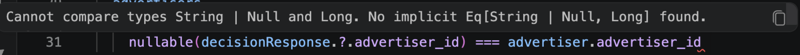  
   An asString is missing here, rather than letting the join silently produce no matches.

5. **Aggregations are enforced**. Expressions inside agg() must be scalar aggregates such as sum, avg, min, max. Passing
   a linear expression instead is a compile-time error, not a runtime crash:  
   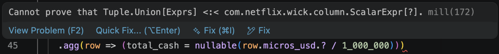  
   sum() is missing here.

6. **Invalid operations are rejected**. Summing a String field like `advertiser_name` is meaningless:  
   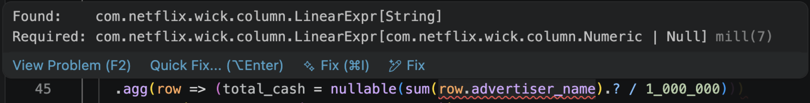  
   In the DataFrame API, this is not only legal, the job runs and silently populates nulls. Wick rejects it at compile
   time.

# Conclusion

Data pipelines are only as valuable as the data they produce. A bug that silently generates wrong numbers for months is
far more damaging than an outage that pages someone at 3am.

Wick addresses this at the source. By encoding schema, types, and nullability directly into the code, it gives both
engineers and AI agents the context they need to reason correctly about a pipeline — without reaching for external
tools.  
Entire classes of bugs become impossible to express: wrong field names, type mismatches in joins, non-aggregate
expressions inside `agg()`, silent null propagation. The compiler catches them before a single byte of data is processed.

This changes what AI-assisted development looks like in practice. Instead of generating code, running a Spark job,
observing wrong output, and iterating, an AI agent gets precise compile-time feedback in the same step. It corrects the
mistake immediately, producing correct pipelines faster and with fewer tokens.

All of this comes at zero performance cost, Wick compiles down to the same Catalyst Optimizer plans as raw DataFrame
code.                                                                                                                       
As AI agents take on more of the work of writing data pipelines, the frameworks they write against matter more than
ever. Wick makes the right code easy to write and the wrong code impossible to compile.

# What’s next?

Wick unlocks new possibilities:

In the example above, we defined case classes like `AdEvent`, `AdDecisionResponse` and `AdAdvertizer` that match the
schema of the corresponding source tables. However, as the tables evolve those classes would go out of sync.  
One solution is to connect these classes to
our [Unified Data Architecture](https://netflixtechblog.com/uda-unified-data-architecture-6a6aee261d8d) Domain Model so
that we can easily synchronize our schemas to the knowledge graph.

Another road to pursue is to enable stricter requirements for AI generated code
with [Capability Tracking for Safer Agents](https://arxiv.org/abs/2603.00991).
